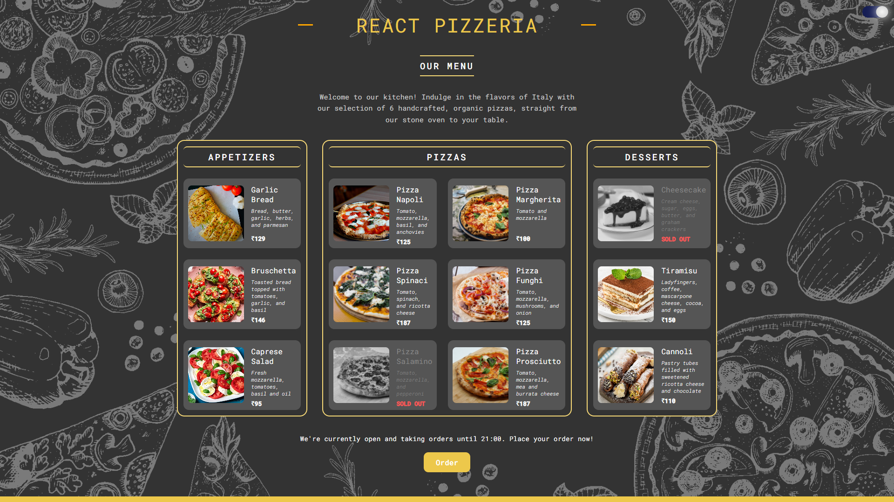
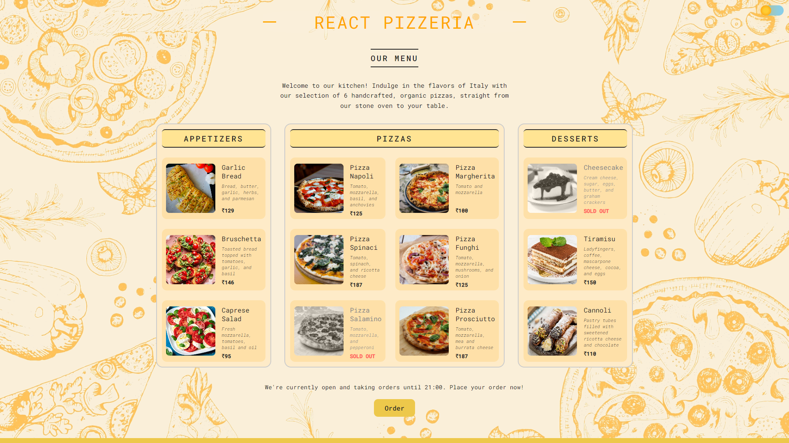

# React Pizzeria

Welcome to React Pizzeria, a simple web application showcasing a pizzeria menu with the ability to toggle between dark and light modes.

## Introduction

React Pizzeria is a React-based web application that allows users to explore a menu consisting of pizzas, appetizers, and desserts. The application provides a dark mode toggle for enhanced user experience.

## Features

- View a variety of pizzas, appetizers, and desserts.
- Toggle between dark and light modes.
- Check the availability and details of each menu item.
- Place orders and explore mouthwatering menu options.

## Installation

1. Clone the repository:

   ```bash
   git clone https://github.com/PrathameshJ-08/react-pizzeria.git
   ```

2. Install dependencies:

   ```bash
   npm install
   ```

3. Start the development server:

   ```bash
   npm start
   ```

---

</div>

  <div style="flex: 1;">
    
    
  </div>
  
---

### 📌 Visit [REACT PIZZERIA](https://react-pizzeria-sage.vercel.app/) to see the application in action.
